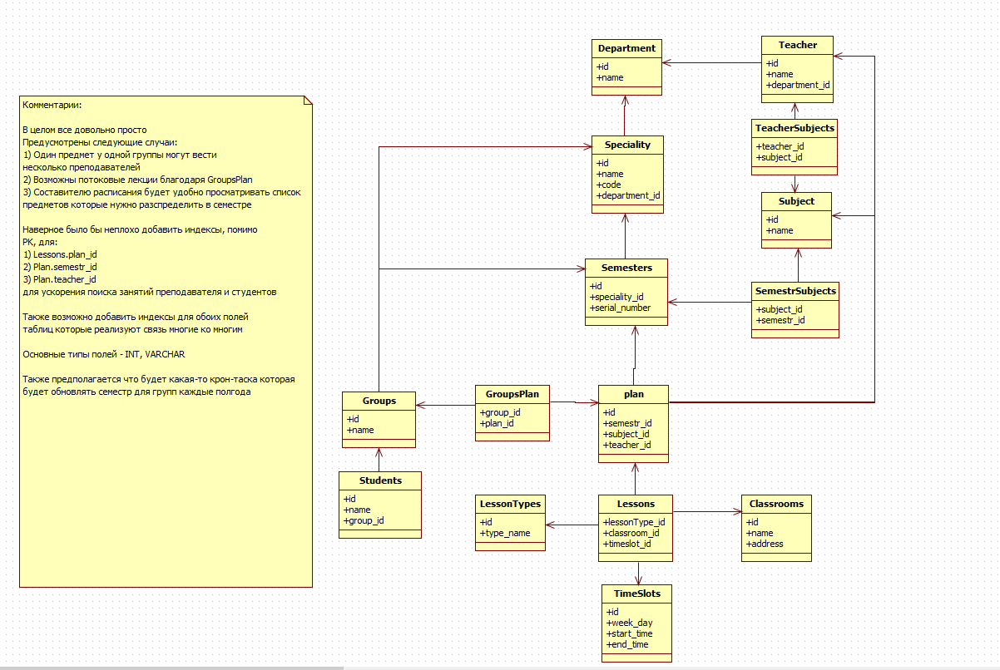

<!-- # TOC -->
- [Функция преобразования целого числа в строку прописью. В любом падеже и в любом роде.](#функция-преобразования-целого-числа-в-строку-прописью-в-любом-падеже-и-в-любом-роде)
- [Схема базы данных, предназначенной для составления расписания занятий в ВУЗе.](#схема-базы-данных-предназначенной-для-составления-расписания-занятий-в-вузе)
- [Сервис для обработки видео.](#сервис-для-обработки-видео)
- [Алгоритм A\* для решения задачи "Пятнашки"](#алгоритм-a-для-решения-задачи-пятнашки)


## [Функция преобразования целого числа в строку прописью. В любом падеже и в любом роде.](./sumProp/)
Прототип функции:
```cpp
string sumProp(int nSum, string sGender, string sCase)
// nSum - целое число менее триллиона (максимум 999 999 999 999)
// sGender - род ("М"-мужской, "Ж"-женский, "С"-средний)
// sCase - падеж ("И"-именительный, ..., "П"-предложный)
```
| Пример вызова функции | Результат |
|-----------------------|-----------|
| sumProp(31, "М", "Р") | "тридцати одного" |                   
| sumProp(22, "С", "Т") | "двадцатью двумя" |
| sumProp(154323, "М", "И") | "сто пятьдесят четыре тысячи триста двадцать три" |
| sumProp(154323, "М", "Т") |	"ста пятьюдесятью четырьмя тысячами тремястами двадцатью тремя" |

## [Схема базы данных, предназначенной для составления расписания занятий в ВУЗе.](./DBSchema/) 


## [Сервис для обработки видео.](./videoProcService/)
Возможности:
- Загружать несколько видео-файлов на обработку
- Получать список загруженных видео, их статус и прогресс обработки
- Остановить/отменить обработку конкретного видео
- Получать информацию о количестве людей на каждом видео
- Заносить в базу людей из видео
- Получать список людей с информацией на каком видео каждый был
обнаружен
- Вносить личные данные людей (ФИО, дату рождения, пол)


## [Алгоритм A* для решения задачи "Пятнашки"](./PuzzleResolver/)
